# Relatório de Análise de Interfaces — Nalida Web

**Produto:** Nalida — Plataforma de Aluguel de Espaços Comerciais
**Aplicação:** `nalida-web` (Next.js · App Router)
**Data de captura:** 22 de maio de 2026
**Viewport de referência:** 390 × 844px (mobile — iPhone 14 Pro)
**Elaborado por:** TrinityWeb

---

## Legenda de Status

| Símbolo | Significado |
|:-------:|-------------|
| ✅ | Implementado e funcional nas duas camadas (frontend + backend) |
| ⚠️ | Existe em uma camada, mas incompleto ou desconectado na outra |
| ❌ | Funcionalidade esperada sem implementação real em nenhuma das camadas |

---

## Índice de Funcionalidades

### Módulo 1 — Autenticação e Acesso

| # | Funcionalidade | Frontend | Backend | Status |
|---|----------------|:--------:|:-------:|:------:|
| [1.1](#tela-login-principal) | Login com Google (OAuth) | ✅ | ✅ | Completo |
| [1.2](#tela-login-email) | Login com e-mail e senha | ✅ | ⚠️ | Parcial |
| [1.3](#tela-login-email) | Login com Apple | ❌ | ❌ | Ausente |
| [1.4](#tela-login-email) | Login com Facebook | ❌ | ❌ | Ausente |
| [1.5](#tela-register) | Cadastro de novo usuário | ✅ | ⚠️ | Parcial |
| [1.6](#tela-login-principal) | Logout e encerramento de sessão | ✅ | ✅ | Completo |
| [1.7](#tela-login-principal) | Renovação automática de token (refresh) | ❌ | ⚠️ | Parcial |
| [1.8](#tela-under-age) | Bloqueio de acesso para menores de 18 anos | ✅ | ❌ | Parcial |
| [1.9](#tela-welcome) | Boas-vindas e captura de geolocalização | ✅ | ❌ | Parcial |
| [1.10](#tela-privacy) | Aceite dos termos de privacidade | ✅ | ❌ | Parcial |
| [1.11](#tela-notifications) | Solicitação de permissão para notificações push | ✅ | ❌ | Ausente |

### Módulo 2 — Descoberta de Espaços

| # | Funcionalidade | Frontend | Backend | Status |
|---|----------------|:--------:|:-------:|:------:|
| [2.1](#tela-private-home) | Listagem de espaços por categoria e proximidade | ✅ | ✅ | Completo |
| [2.2](#tela-private-more) | Busca por texto (cidade ou bairro) | ✅ | ⚠️ | Parcial |
| [2.3](#tela-private-more) | Filtros de preço, comodidades e distância | ✅ | ⚠️ | Parcial |
| [2.4](#tela-private-more) | Visualização em mapa com marcadores | ✅ | ✅ | Completo |
| [2.5](#tela-private-place) | Detalhe completo do espaço | ✅ | ✅ | Completo |
| [2.6](#tela-private-more) | Paginação de resultados | ✅ | ✅ | Completo |
| [2.7](#tela-private-place) | Avaliação média do espaço | ✅ | ✅ | Completo |

### Módulo 3 — Fluxo de Reserva

| # | Funcionalidade | Frontend | Backend | Status |
|---|----------------|:--------:|:-------:|:------:|
| [3.1](#tela-booking-calendar) | Seleção de datas | ✅ | ✅ | Completo |
| [3.2](#tela-booking-hours) | Seleção de horário de entrada e saída | ✅ | ✅ | Completo |
| [3.3](#tela-booking-calendar) | Verificação de disponibilidade em tempo real | ✅ | ✅ | Completo |
| [3.4](#tela-booking-guests) | Seleção de hóspedes adicionais | ✅ | ✅ | Completo |
| [3.5](#tela-booking-confirm) | Cálculo e exibição do valor total | ✅ | ⚠️ | Parcial |
| [3.6](#tela-booking-confirm) | Criação da reserva | ✅ | ✅ | Completo |
| [3.7](#tela-booking-confirm) | Processamento do pagamento | ✅ | ❌ | Ausente |
| [3.8](#tela-status-book) | Acompanhamento do status da reserva | ✅ | ✅ | Completo |
| [3.9](#tela-reservations) | Lista de reservas (ativas, inativas, anteriores) | ✅ | ✅ | Completo |
| [3.10](#tela-reservations) | Avaliação do espaço após reserva concluída | ✅ | ✅ | Completo |
| [3.11](#tela-status-book-cancel) | Cancelamento de reserva pelo locatário | ✅ | ⚠️ | Parcial |

### Módulo 4 — Mensagens e Conversas

| # | Funcionalidade | Frontend | Backend | Status |
|---|----------------|:--------:|:-------:|:------:|
| [4.1](#tela-conversations) | Lista de conversas (abertas e fechadas) | ✅ | ❌ | Parcial |
| [4.2](#tela-conversations-chat) | Envio e recebimento de mensagens em tempo real | ✅ | ❌ | Parcial |
| [4.3](#tela-conversations-chat) | Histórico de mensagens persistido | ✅ | ❌ | Parcial |
| [4.4](#tela-conversations-chat) | Notificação de nova mensagem | ❌ | ❌ | Ausente |

### Módulo 5 — Painel do Proprietário e Cadastro de Espaço

| # | Funcionalidade | Frontend | Backend | Status |
|---|----------------|:--------:|:-------:|:------:|
| [5.1](#tela-lessee-my-place) | Lista de espaços cadastrados | ✅ | ✅ | Completo |
| [5.2](#tela-lessee-faq) | Perguntas frequentes (FAQ) | ✅ | ✅ | Completo |
| [5.3](#form-place-initial-info) | Cadastro — informações gerais | ✅ | ✅ | Completo |
| [5.4](#form-place-address) | Cadastro — endereço com consulta por CEP | ✅ | ✅ | Completo |
| [5.5](#form-place-schedule) | Cadastro — disponibilidade e horários | ✅ | ✅ | Completo |
| [5.6](#form-place-values) | Cadastro — valores e preços | ✅ | ✅ | Completo |
| [5.7](#form-place-hour) | Cadastro — reserva por hora | ✅ | ✅ | Completo |
| [5.8](#form-place-discount) | Cadastro — desconto para estadias longas | ✅ | ✅ | Completo |
| [5.9](#form-place-space-configs) | Cadastro — configurações físicas e comodidades | ✅ | ✅ | Completo |
| [5.10](#form-place-rules) | Cadastro — regras, check-in e política de cancelamento | ✅ | ✅ | Completo |
| [5.11](#form-place-guests) | Cadastro — preferências de hóspedes | ✅ | ✅ | Completo |
| [5.12](#form-place-images) | Cadastro — upload de fotos | ✅ | ⚠️ | Parcial |
| [5.13](#form-place-result) | Publicação do espaço | ✅ | ⚠️ | Parcial |

### Módulo 6 — Gestão de Reservas pelo Proprietário

| # | Funcionalidade | Frontend | Backend | Status |
|---|----------------|:--------:|:-------:|:------:|
| [6.1](#tela-lessee-info-place) | Estatísticas: reservas, faturamento e hóspedes | ✅ | ✅ | Completo |
| [6.2](#tela-lessee-schedule) | Agenda visual do espaço | ✅ | ⚠️ | Parcial |
| [6.3](#tela-lessee-status-guest) | Acompanhamento de presença do hóspede | ✅ | ⚠️ | Parcial |
| [6.4](#tela-approve-booking) | Reservas pendentes de aprovação | ✅ | ✅ | Completo |
| [6.5](#tela-approve-booking-detail) | Aprovar reserva | ✅ | ✅ | Completo |
| [6.6](#tela-approve-deny) | Negar reserva com motivo | ✅ | ✅ | Completo |
| [6.7](#tela-completed-booking) | Reservas concluídas | ✅ | ✅ | Completo |
| [6.8](#tela-completed-booking-approve) | Avaliação do hóspede após reserva | ✅ | ✅ | Completo |

### Módulo 7 — Perfil do Usuário

| # | Funcionalidade | Frontend | Backend | Status |
|---|----------------|:--------:|:-------:|:------:|
| [7.1](#tela-profile) | Visualizar perfil próprio | ✅ | ✅ | Completo |
| [7.2](#tela-profile-name) | Editar nome | ✅ | ✅ | Completo |
| [7.3](#tela-profile-birthday) | Editar data de nascimento | ✅ | ⚠️ | Parcial |
| [7.4](#tela-profile-address) | Gerenciar endereços | ✅ | ✅ | Completo |
| [7.5](#tela-payment-method) | Adicionar cartão de crédito | ✅ | ✅ | Completo |
| [7.6](#tela-payment-method) | Remover cartão de crédito | ✅ | ✅ | Completo |
| [7.7](#tela-receiver-method) | Cadastrar conta bancária para recebimento | ✅ | ⚠️ | Parcial |
| [7.8](#tela-profile-document-picture) | Verificação de identidade (documento + câmera) | ✅ | ❌ | Ausente |
| [7.9](#tela-guest-profile) | Visualizar perfil público de outro usuário | ✅ | ✅ | Completo |
| [7.10](#tela-profile) | Alternância entre modo cliente e host | ✅ | ✅ | Completo |

---

## Visão Geral da Plataforma

O Nalida opera em dois modos de uso distintos dentro do mesmo aplicativo:

- **Lessor** — usuário que busca e aluga espaços comerciais
- **Lessee** — usuário que disponibiliza e gerencia seus próprios espaços

O toggle entre os modos é feito na tela de perfil e determina qual dashboard é exibido após o login. O relatório a seguir cobre **todas as 53 telas** mapeadas no frontend, organizadas em 7 módulos funcionais.

---

---

## Módulo 1 — Autenticação e Acesso

> Cobre todas as telas acessíveis antes da autenticação e o onboarding imediatamente após o primeiro login.

**Telas cobertas:** 9 · **Rotas públicas:** 6 · **Onboarding pós-login:** 3

| Grupo | Rotas |
|-------|-------|
| Autenticação | `/login`, `/manual-login`, `/register`, `/register/step-one`, `/register/step-two`, `/under-age` |
| Onboarding pós-login | `/welcome`, `/privacy`, `/notifications` |

---

<a id="tela-login-principal"></a>

### Tela: Login Principal — `/login`

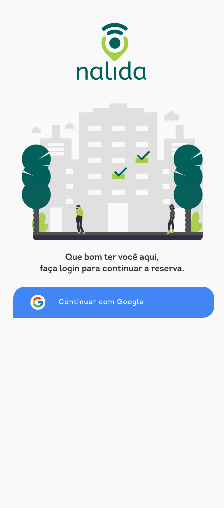

**Descrição**
Ponto de entrada da plataforma. Concentra os métodos de autenticação disponíveis.

**Funcionalidades**
- Autenticação via Google OAuth (ativo)
- Link para login com e-mail e senha (`/manual-login`)
- Verificação de sessão ativa com redirect automático para `/private` ou `/private/lessee`
- Placeholders para Apple e Facebook (comentados no código — não renderizados)

**Fluxo de saída**
- Google OAuth → `/welcome`
- "Entrar com e-mail" → `/manual-login`
- Sessão ativa detectada → `/private`

**Status:** ✅ Completo (Google OAuth funcional)

**Observações**
- Apple e Facebook não implementados em nenhuma camada
- Sem opção de "Esqueci minha senha"

---

<a id="tela-login-email"></a>

### Tela: Login com E-mail — `/manual-login`

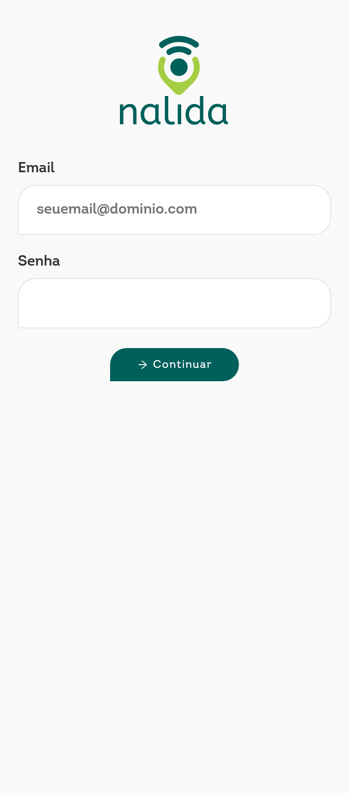

**Descrição**
Formulário de autenticação tradicional com e-mail e senha cadastrados no Firebase Auth.

**Funcionalidades**
- Campo de e-mail
- Campo de senha com toggle de visibilidade
- Validação de credenciais via Firebase Auth
- Link de retorno para `/login`

**Fluxo de saída**
- Credenciais válidas → `POST /auth/login` → `/welcome`
- Credenciais inválidas → erro inline

**Status:** ⚠️ Parcial

**Observações**
- Funciona apenas para contas já criadas no Firebase Auth
- Sem endpoint de cadastro por e-mail/senha no backend
- Sem "Esqueci minha senha"

---

<a id="tela-register"></a>

### Tela: Entrada do Cadastro — `/register`

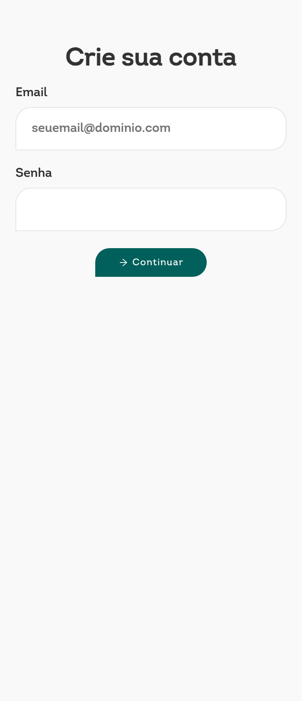

**Descrição**
Tela de entrada do fluxo de cadastro. Redireciona automaticamente para o step 1.

**Status:** ✅ Completo (redirect)

---

<a id="tela-register-step-one"></a>

### Tela: Cadastro — Etapa 1 — `/register/step-one`

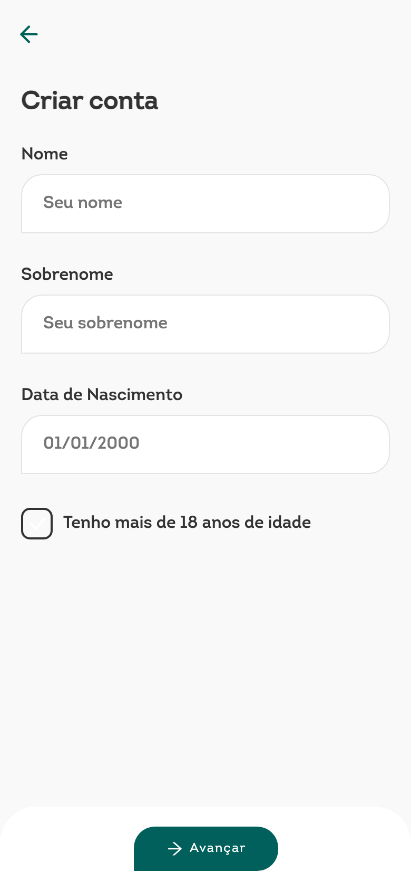

**Descrição**
Coleta e-mail e senha para criar a conta no Firebase Auth.

**Funcionalidades**
- Campo de e-mail
- Campo de senha e confirmação
- Indicador de progresso (1 de 2)
- Criação da conta via `createUserWithEmailAndPassword`

**Fluxo de saída**
- Dados válidos → `/register/step-two`

**Status:** ⚠️ Parcial

**Observações**
- Conta criada no Firebase Auth nesta etapa
- Nome e data de nascimento (step 2) não são enviados ao backend no upsert

---

<a id="tela-register-step-two"></a>

### Tela: Cadastro — Etapa 2 — `/register/step-two`

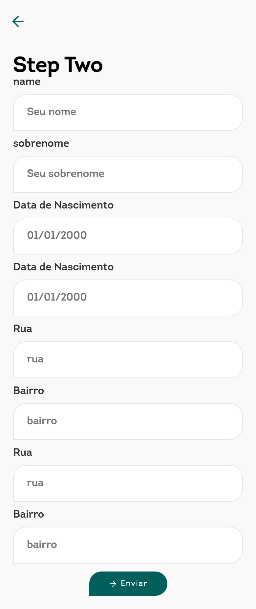

**Descrição**
Coleta nome completo e data de nascimento. Valida maioridade antes de prosseguir.

**Funcionalidades**
- Campos de nome e sobrenome
- Data de nascimento com máscara DD/MM/YYYY
- Validação de maioridade (18+)
- Indicador de progresso (2 de 2)

**Fluxo de saída**
- Idade ≥ 18 → `POST /auth/login` → `/welcome`
- Idade < 18 → `/under-age`

**Status:** ⚠️ Parcial

**Observações**
- Validação de maioridade apenas no frontend
- Nome e data de nascimento não persistidos no backend

---

<a id="tela-under-age"></a>

### Tela: Bloqueio de Acesso — `/under-age`

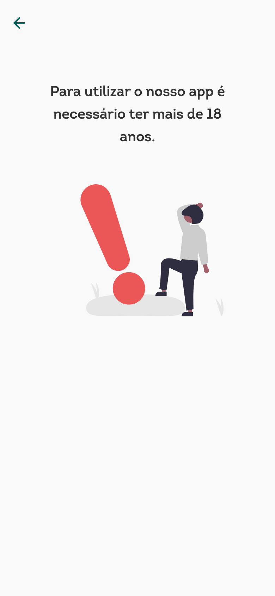

**Descrição**
Tela terminal exibida quando o usuário informa menos de 18 anos.

**Funcionalidades**
- Mensagem de bloqueio
- Sem caminho de retorno ou alternativa

**Status:** ⚠️ Parcial

**Observações**
- Validação apenas no frontend — contornável acessando `/login` diretamente
- Backend não armazena data de nascimento nem bloqueia a conta por idade

---

<a id="tela-welcome"></a>

### Tela: Boas-vindas e Geolocalização — `/welcome`

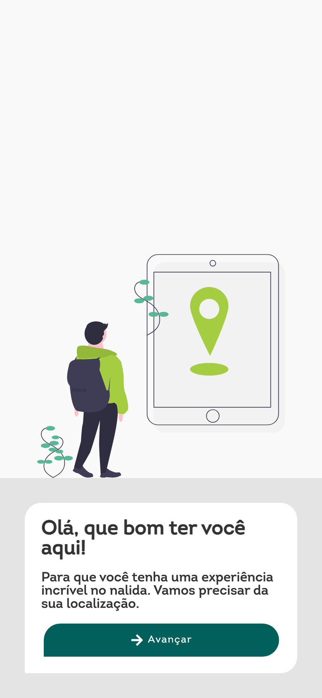

**Descrição**
Primeira tela após o login. Solicita permissão de geolocalização e direciona ao dashboard correto.

**Funcionalidades**
- Solicitação de permissão de geolocalização do navegador
- Redirect condicional por modo ativo (lessor → `/private` / lessee → `/private/lessee`)

**Status:** ⚠️ Parcial

**Observações**
- Coordenadas salvas apenas em memória (`LocationProvider`) — não persistidas no backend
- Sem fallback quando o usuário nega a permissão

---

<a id="tela-privacy"></a>

### Tela: Termos de Privacidade — `/privacy`

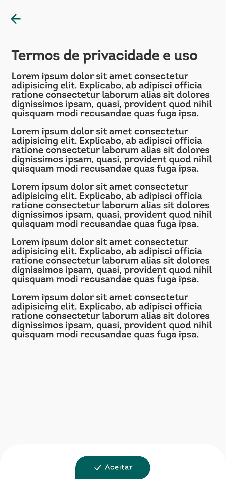

**Descrição**
Exibe os termos de privacidade e registra o aceite do usuário.

**Funcionalidades**
- Texto dos termos (scrollável)
- Botão "Aceitar" → flag `privacyAccepted: true` no contexto global

**Status:** ⚠️ Parcial

**Observações**
- Aceite registrado apenas em memória — sem campo `acceptedTermsAt` no banco
- Não auditável por usuário

---

<a id="tela-notifications"></a>

### Tela: Permissão de Notificações — `/notifications`

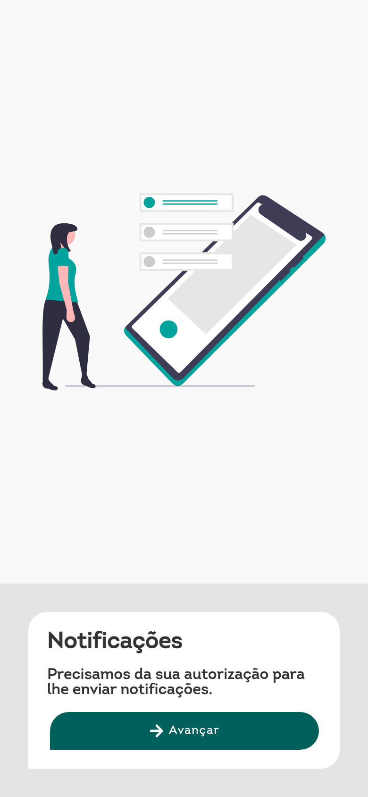

**Descrição**
Solicita autorização para envio de notificações push.

**Funcionalidades**
- Botão "Autorizar notificações" (sem efeito funcional atualmente)

**Status:** ❌ Ausente

**Observações**
- Sem integração com Firebase Cloud Messaging
- Sem endpoint no backend para registrar token do dispositivo

---

### Mapa de Fluxo — Módulo 1

```
[Acesso inicial]
      │
      ▼
   /login
      │
      ├── Google OAuth ──────────────────────────────────────────┐
      ├── "Entrar com e-mail" ──► /manual-login                  │
      │                               │                          │
      └── "Cadastrar" ──► /register ──► /register/step-one       │
                                             │                   │
                                   /register/step-two            │
                                        │        │               │
                                   idade ≥ 18   < 18             │
                                        │        │               │
                                        │   /under-age           │
                                        │   (terminal)           │
                             ◄──────────┘◄───────────────────────┘
                             POST /auth/login
                                        │
                                        ▼
                                    /welcome → /privacy → /notifications
                                        │
                             ┌──────────┴──────────┐
                             ▼                     ▼
                         /private          /private/lessee
                      (modo lessor)       (modo lessee)
```

---

### Resumo de Status — Módulo 1

| Tela | Rota | Status | Lacunas |
|------|------|:------:|---------|
| Login principal | `/login` | ✅ | Apple e Facebook não implementados |
| Login com e-mail | `/manual-login` | ⚠️ | Sem "Esqueci minha senha" |
| Entrada do cadastro | `/register` | ✅ | — |
| Cadastro etapa 1 | `/register/step-one` | ⚠️ | Dados do step 2 não persistidos |
| Cadastro etapa 2 | `/register/step-two` | ⚠️ | Validação de maioridade só no frontend |
| Bloqueio de acesso | `/under-age` | ⚠️ | Contornável; sem validação no backend |
| Boas-vindas | `/welcome` | ⚠️ | Geolocalização não persistida |
| Termos de privacidade | `/privacy` | ⚠️ | Aceite não auditável |
| Notificações | `/notifications` | ❌ | Sem integração FCM |

---

---

## Módulo 2 — Descoberta de Espaços

> Cobre o fluxo principal do modo lessor: dashboard de busca, listagem por categoria e detalhe do espaço.

**Telas cobertas:** 3

---

<a id="tela-private-home"></a>

### Tela: Dashboard de Busca — `/private`

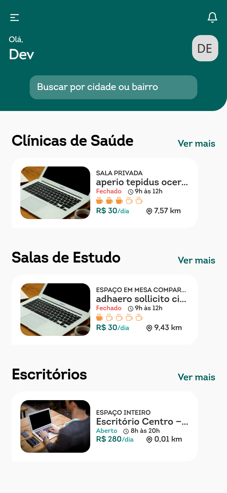

**Descrição**
Dashboard principal do modo lessor. Exibe espaços agrupados por categoria, priorizando os mais próximos ao usuário.

**Funcionalidades**
- Campo de busca por texto (cidade ou bairro)
- Seções por categoria com até 5 cards cada
- Link "Ver mais" por categoria
- Card de espaço: foto, nome, tipo, preço e distância
- Ordenação por proximidade via geolocalização automática
- Navbar inferior de navegação

**Fluxo de saída**
- Card de espaço → `/private/place?uid=`
- "Ver mais" → `/private/more?category=&slug=`
- Busca por texto → `/private/more` com filtro

**Dependências de dados**
- `GET /place/near?lat=&lng=&maxDistance=10000` — uma chamada por categoria, em paralelo

**Status:** ✅ Completo

**Observações**
- Sem fallback quando geolocalização é negada
- Máximo de 5 resultados por categoria — paginação apenas via "Ver mais"

---

<a id="tela-private-more"></a>

### Tela: Listagem por Categoria — `/private/more`


**Descrição**
Listagem completa de espaços de uma categoria. Oferece filtros avançados e alternância entre lista e mapa.

**Funcionalidades**
- Header com nome da categoria e contagem de resultados
- Toggle lista / mapa interativo (Google Maps)
- Filtros: faixa de preço (slider), comodidades, distância máxima
- Marcadores no mapa com popup de card ao clicar
- Paginação de resultados
- Campo de busca por texto

**Fluxo de saída**
- Card ou marcador → `/private/place?uid=`

**Dependências de dados**
- `GET /place?where[category][slug]=:slug&lat=&lng=&page=1&size=10`

**Status:** ⚠️ Parcial

**Observações**
- Filtros de preço e distância processados no cliente — sem operadores `gte`/`lte` no backend
- Busca por texto sem full-text search — apenas correspondência exata de campo

---

<a id="tela-private-place"></a>

### Tela: Detalhe do Espaço — `/private/place?uid=`

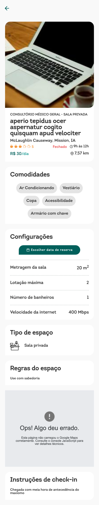

**Descrição**
Tela completa de informações de um espaço antes de iniciar a reserva.

**Funcionalidades**
- Galeria de fotos (carrossel)
- Nome, tipo, categoria, endereço e mapa de localização
- Capacidade, banheiros, m², velocidade de internet
- Preços: diária, hora (se habilitado), hóspede adicional, taxa de limpeza
- Comodidades com ícones, regras, política de cancelamento, instruções de check-in
- Avaliação média (estrelas + número de avaliações)
- Botão "Reservar" fixo no rodapé

**Fluxo de saída**
- "Reservar" → `/private/booking/calendar?uid=`

**Dependências de dados**
- `GET /place/:uid?include[conveniences]=true&include[spaceType]=true&include[category]=true`
- `GET /rating/average/:uid`

**Status:** ✅ Completo

---

### Mapa de Fluxo — Módulo 2

```
/private (home)
    │
    ├── "Ver mais" ──► /private/more
    │                       │
    │               ┌───────┴───────┐
    │             lista            mapa
    │               │               │
    └── card ───────┴───────────────┘
                    │
                    ▼
           /private/place?uid=
                    │
               "Reservar"
                    │
                    ▼
         /private/booking/calendar
              (Módulo 3)
```

---

### Resumo de Status — Módulo 2

| Tela | Rota | Status | Lacunas |
|------|------|:------:|---------|
| Dashboard de busca | `/private` | ✅ | Sem fallback sem geolocalização |
| Listagem por categoria | `/private/more` | ⚠️ | Filtros no cliente; sem full-text search |
| Detalhe do espaço | `/private/place` | ✅ | — |

---

---

## Módulo 3 — Fluxo de Reserva

> Cobre o processo completo de criação de reserva (4 etapas sequenciais) e a gestão das reservas pelo locatário.

**Telas cobertas:** 7

---

### Sub-fluxo: Criação de Reserva

<a id="tela-booking-calendar"></a>

### Tela: Seleção de Datas — `/private/booking/calendar?uid=`

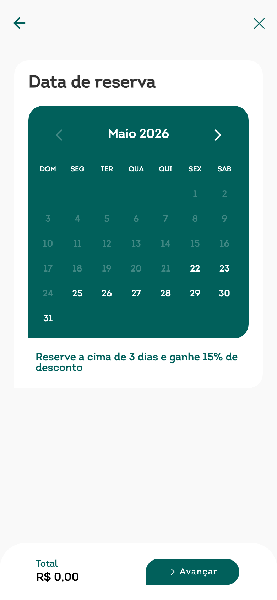

**Descrição**
Etapa 1 de 4. Calendário interativo para seleção do período da reserva.

**Funcionalidades**
- Calendário mensal com navegação entre meses
- Dias passados e indisponíveis bloqueados visualmente
- Seleção de intervalo (check-in / check-out)
- Exibição de desconto para reservas longas (quando aplicável)
- Cálculo de preço em tempo real

**Fluxo de saída**
- Espaço com `allowsBookPerHour = true` → `/booking/hours`
- Espaço com `allowsBookPerHour = false` → `/booking/guests`

**Status:** ✅ Completo

**Observações**
- Disponibilidade validada também no backend via `checkAvailability()` no momento da criação

---

<a id="tela-booking-hours"></a>

### Tela: Seleção de Horários — `/private/booking/hours?uid=`

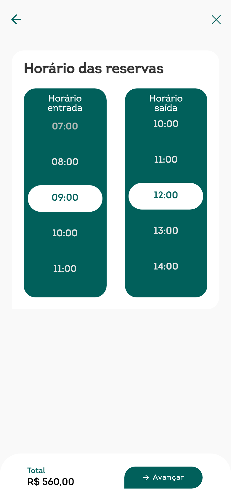

**Descrição**
Etapa 2 de 4 (opcional). Seleção de horário de entrada e saída para espaços que permitem reserva por hora.

**Funcionalidades**
- Seletor de horário de entrada (respeita horário de abertura)
- Seletor de saída com horas ≤ entrada desabilitadas
- Toggle "Reservar dia inteiro"
- Atualização dinâmica do preço

**Status:** ✅ Completo

---

<a id="tela-booking-guests"></a>

### Tela: Hóspedes Adicionais — `/private/booking/guests?uid=`

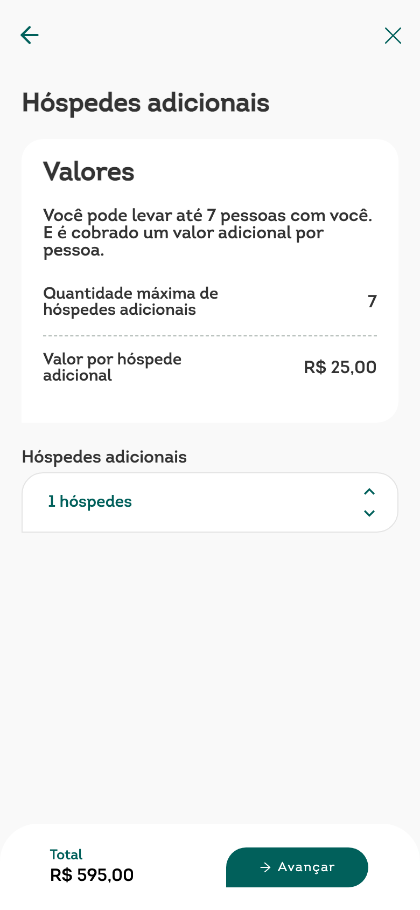

**Descrição**
Etapa 3 de 4. Define quantos hóspedes adicionais além do titular utilizarão o espaço.

**Funcionalidades**
- Input numérico com limite baseado em `maximumCapacity`
- Custo adicional calculado em tempo real
- Resumo acumulado das etapas anteriores

**Status:** ✅ Completo

---

<a id="tela-booking-confirm"></a>

### Tela: Confirmação e Pagamento — `/private/booking/confirm?uid=`

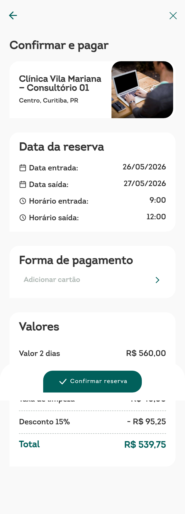

**Descrição**
Etapa 4 de 4. Resumo completo da reserva com seleção de forma de pagamento.

**Funcionalidades**
- Discriminação detalhada de valores (diária/hora, hóspedes, limpeza, desconto, total)
- Seleção de cartão de crédito cadastrado
- Envio da reserva via `POST /booking`

**Fluxo de saída**
- Confirmar → reserva criada com status `PENDING` → `/status-book/[uid]`

**Status:** ⚠️ Parcial

**Observações**
- **Pagamento não é processado** — infraestrutura de campos existe, mas nenhum gateway está integrado
- `totalPrice` calculado no frontend sem validação server-side

---

### Sub-fluxo: Gestão de Reservas

<a id="tela-reservations"></a>

### Tela: Minhas Reservas — `/private/reservations`


**Descrição**
Painel do locatário com todas as suas reservas organizadas por status.

**Funcionalidades**
- Aba Ativas: `PENDING`, `CONFIRMED`, `PROCESSING`, `IN_PROGRESS`
- Aba Inativas: `CANCELED`, `REJECTED`
- Aba Anteriores: `COMPLETED`
- Modal de avaliação inline para reservas concluídas (critérios + comentário)

**Status:** ⚠️ Parcial

**Observações**
- Avaliação disponível apenas para espaços — sem fluxo para avaliar o proprietário
- Múltiplas requisições individuais por booking para buscar dados do espaço

---

<a id="tela-status-book"></a>

### Tela: Detalhe da Reserva — `/private/status-book/[uid]`

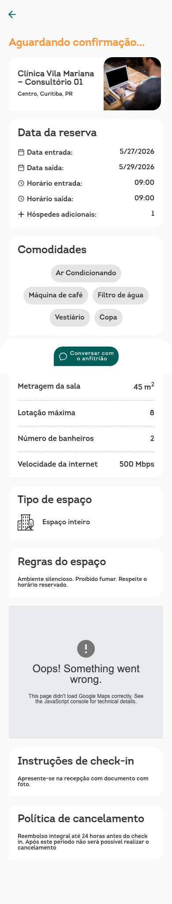

**Descrição**
Detalhe completo de uma reserva com status visual e ações disponíveis.

**Funcionalidades**
- Dados do espaço, datas, horários, hóspedes, comodidades, mapa
- Status com cor: `PENDING` (laranja), `CONFIRMED` (verde), `REJECTED` (vermelho), `COMPLETED`, `CANCELED`
- Botão "Conversar com o anfitrião" → `/conversations/chat/[uid]`
- Botão "Cancelar reserva" → `/status-book/cancel`

**Status:** ✅ Completo

**Observações**
- Bug: botão "Cancelar reserva" aparece apenas para status `COMPLETED` — deveria ser `CONFIRMED`

---

<a id="tela-status-book-cancel"></a>

### Tela: Cancelamento de Reserva — `/private/status-book/cancel`

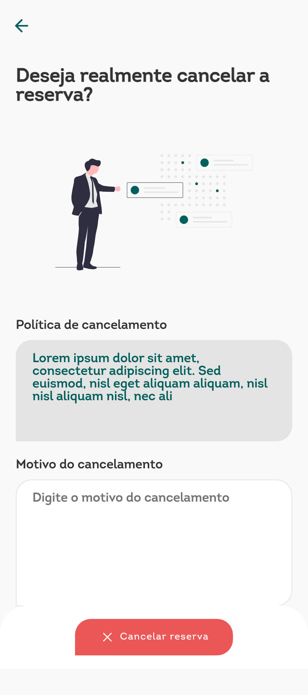

**Descrição**
Fluxo de cancelamento com exibição da política e campo de motivo.

**Funcionalidades**
- Resumo da reserva e texto da política de cancelamento
- Campo de motivo (texto livre)
- Confirmação antes de enviar → `PATCH /booking/:uid` com `bookingStatus: CANCELED`

**Status:** ⚠️ Parcial

**Observações**
- Política de cancelamento exibida apenas visualmente — sem aplicação de regras (prazo, multa, estorno)
- Motivo não persistido no backend
- Sem notificação ao proprietário após o cancelamento

---

### Mapa de Fluxo — Módulo 3

```
/private/place → "Reservar"
        │
        ▼
booking/calendar ──► booking/hours (se allowsBookPerHour)
        │                   │
        └───────────────────┘
                │
                ▼
        booking/guests → booking/confirm → POST /booking
                                                │
                                         status-book/[uid]
                                                │
                                    ┌───────────┴───────────┐
                                    │                       │
                              "Conversar"             "Cancelar"
                                    │                       │
                             conversations/          status-book/cancel
                             chat/[uid]
```

---

### Resumo de Status — Módulo 3

| Tela | Rota | Status | Lacunas |
|------|------|:------:|---------|
| Seleção de datas | `booking/calendar` | ✅ | — |
| Seleção de horários | `booking/hours` | ✅ | — |
| Hóspedes adicionais | `booking/guests` | ✅ | — |
| Confirmação e pagamento | `booking/confirm` | ⚠️ | Gateway não integrado |
| Minhas reservas | `/reservations` | ⚠️ | Sem avaliação de proprietário |
| Detalhe da reserva | `status-book/[uid]` | ✅ | Bug no botão cancelar |
| Cancelamento | `status-book/cancel` | ⚠️ | Política apenas visual; motivo não persistido |

---

---

## Módulo 4 — Mensagens e Conversas

> Canal de comunicação em tempo real entre locatário e proprietário, construído sobre o Firebase Realtime Database.

**Telas cobertas:** 2

---

<a id="tela-conversations"></a>

### Tela: Lista de Conversas — `/private/conversations`

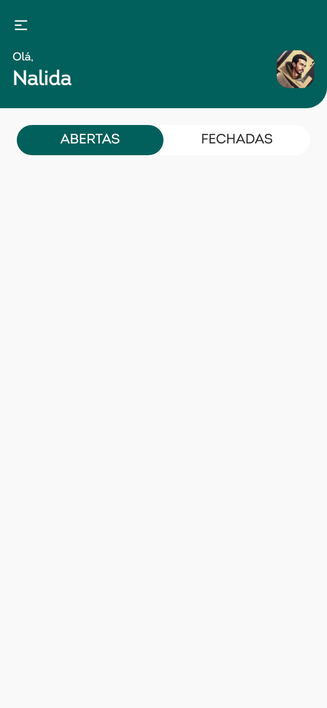

**Descrição**
Lista de todas as conversas do usuário, filtradas por modo ativo e status.

**Funcionalidades**
- Toggle "Abertas / Fechadas"
- Card de conversa: avatar, nome, prévia da última mensagem e timestamp
- Leitura direta do Firebase RTDB: nó `users/:uid/chats/:appMode`

**Fluxo de saída**
- Clicar em conversa → `/conversations/chat/[uid]`

**Status:** ⚠️ Parcial

**Observações**
- Sem badge de mensagens não lidas
- Sem busca por nome de usuário
- Dependência total do Firebase RTDB — sem backup no MongoDB

---

<a id="tela-conversations-chat"></a>

### Tela: Chat em Tempo Real — `/private/conversations/chat/[uid]`

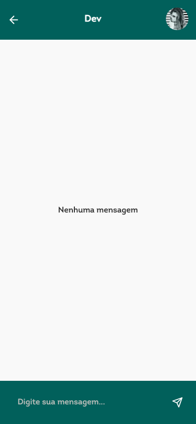

**Descrição**
Chat em tempo real com histórico de mensagens e listener automático de atualizações.

**Funcionalidades**
- Histórico de mensagens com bolhas diferenciadas por remetente
- Listener em tempo real via `onValue` (Firebase RTDB)
- Campo de texto e envio de mensagem
- Scroll automático para a última mensagem
- Botão para marcar conversa como aberta/fechada

**Status:** ⚠️ Parcial

**Observações**
- Histórico não sincronizado com MongoDB
- Sem notificação push para mensagens recebidas offline
- Sem indicador de "digitando..."
- Sem suporte a envio de imagens ou arquivos
- Sem paginação do histórico

---

### Resumo de Status — Módulo 4

| Tela | Rota | Status | Lacunas |
|------|------|:------:|---------|
| Lista de conversas | `/conversations` | ⚠️ | Sem badge; sem busca; dependência Firebase |
| Chat em tempo real | `/conversations/chat/[uid]` | ⚠️ | Sem notificação offline; sem mídia; sem paginação |

---

---

## Módulo 5 — Painel do Proprietário e Cadastro de Espaço

> Cobre o modo lessee: dashboard de gerenciamento e formulário multi-step de cadastro/edição de espaço (10 etapas).

**Telas cobertas:** 15

> Dados do formulário são persistidos em `localStorage` sob a chave `@nalida/create-place`. O espaço é criado no banco apenas na etapa final.

---

### Tela: Redirect Lessee — `/private/lessee`


**Descrição**
Rota de entrada do modo lessee. Redirect automático para `/private/lessee/my-place`.

**Status:** ✅ Completo

---

<a id="tela-lessee-my-place"></a>

### Tela: Meus Espaços — `/private/lessee/my-place`

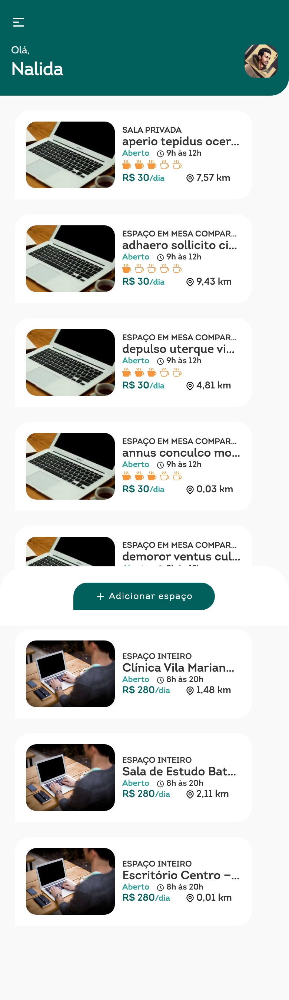

**Descrição**
Dashboard principal do proprietário. Lista todos os espaços cadastrados com ações de gerenciamento.

**Funcionalidades**
- Lista de espaços com foto, nome, categoria e status (ativo/inativo)
- Ações: editar, visualizar, deletar
- Botão "Adicionar espaço"
- Links para: agenda, reservas pendentes, reservas concluídas, estatísticas

**Status:** ✅ Completo

---

<a id="tela-lessee-faq"></a>

### Tela: Perguntas Frequentes — `/private/lessee/faq`

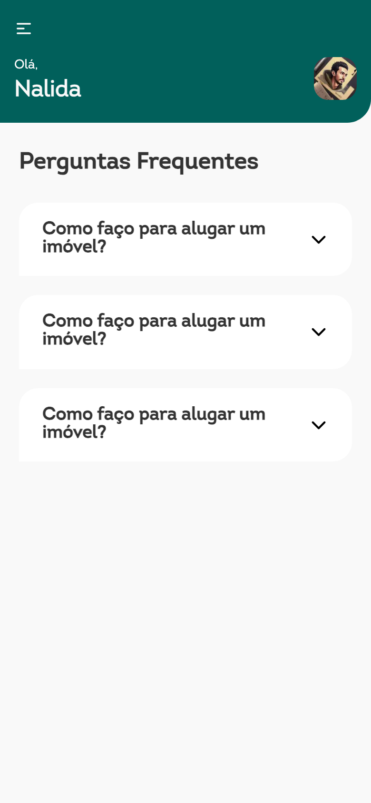

**Descrição**
FAQ para proprietários com cards expansíveis. Conteúdo estático.

**Status:** ✅ Completo

---

### Formulário de Cadastro de Espaço — `form-place`

> Barra de progresso visível em todas as etapas. Suporta criação e edição no mesmo formulário.

---

<a id="form-place-initial-info"></a>

#### Etapa 1 — Informações Gerais `initial-info` (10%)

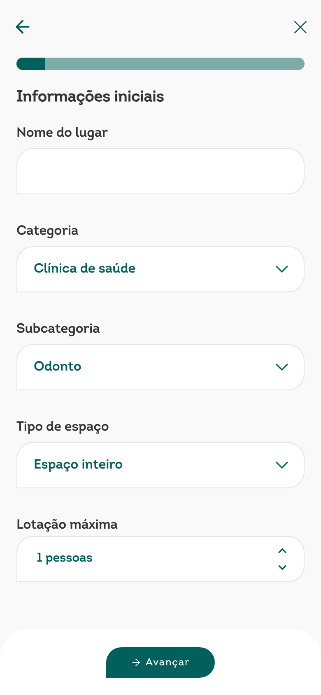

| Campo | Tipo | Validação |
|-------|------|-----------|
| Nome do lugar (`title`) | Text | Obrigatório |
| Categoria (`category`) | Select | Carregado de `GET /category` |
| Subcategoria (`subCategory`) | Select | Filtrada dinamicamente |
| Tipo de espaço (`spaceTypeUid`) | Select | Carregado de `GET /spaceType` |
| Lotação máxima (`maximumCapacity`) | Numérico | Mínimo: 1 |

**Status:** ✅ Completo

---

<a id="form-place-address"></a>

#### Etapa 2 — Endereço `address` (20%)

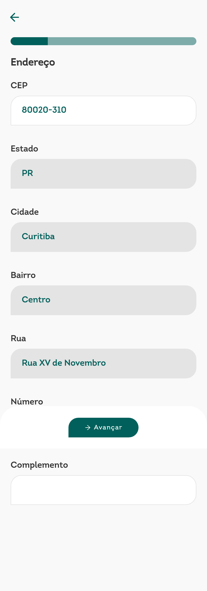

| Campo | Tipo | Observação |
|-------|------|------------|
| CEP (`zipCode`) | Text | Consulta ViaCEP automaticamente |
| Estado, Cidade, Bairro, Rua | Text | Preenchidos via ViaCEP; somente leitura |
| Número (`number`) | Text | Dispara geocodificação → `lat`/`lng` |
| Complemento (`complement`) | Text | Opcional |

**Status:** ✅ Completo

---

<a id="form-place-schedule"></a>

#### Etapa 3 — Disponibilidade `schedule` (30%)

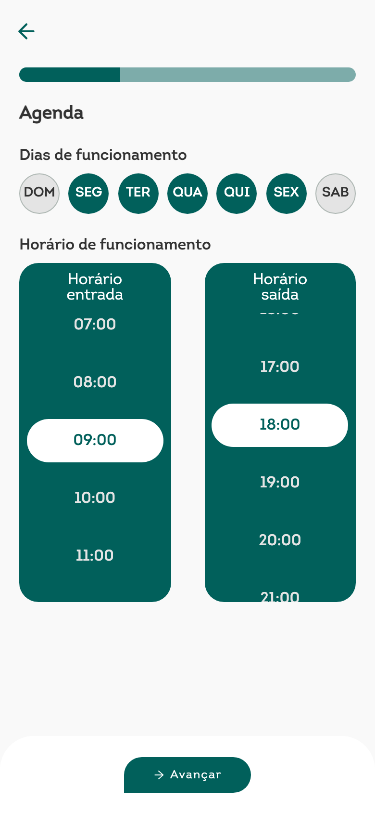

| Campo | Tipo | Observação |
|-------|------|------------|
| Dias de funcionamento (`schedule`) | Checkboxes | Dom–Sab; mínimo 1 dia |
| Horário de entrada (`hours[0]`) | HourPicker | — |
| Horário de saída (`hours[1]`) | HourPicker | Desabilita horas ≤ entrada |

**Status:** ✅ Completo

---

<a id="form-place-values"></a>

#### Etapa 4 — Valores por Diária `values` (40%)

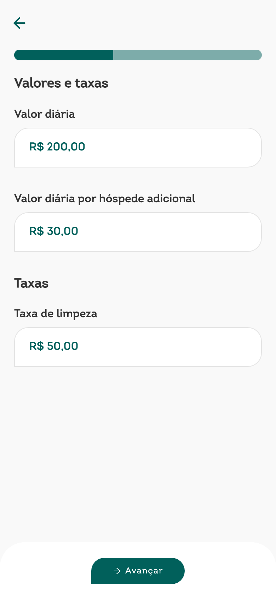

| Campo | Tipo | Observação |
|-------|------|------------|
| Valor diária (`dailyRate`) | Moeda R$ | Obrigatório |
| Hóspede adicional/dia (`additionalGuestDay`) | Moeda R$ | Obrigatório |
| Taxa de limpeza (`cleeaningFee`) | Moeda R$ | Typo no nome interno |

**Status:** ✅ Completo

---

<a id="form-place-hour"></a>

#### Etapa 5 — Reserva por Hora `hour` (50%)

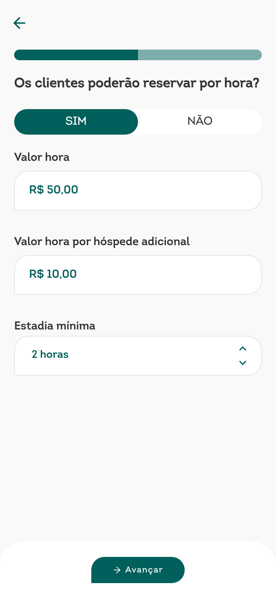

| Campo | Tipo | Observação |
|-------|------|------------|
| Permite reserva por hora? (`allowsBookPerHour`) | Switcher | Habilita campos abaixo |
| Valor hora (`hourRate`) | Moeda R$ | Desabilitado se `false` |
| Hóspede adicional/hora (`additionalGuestHour`) | Moeda R$ | Desabilitado se `false` |
| Estadia mínima (`minimumStayInHours`) | Numérico | 1–24h; desabilitado se `false` |

**Status:** ✅ Completo

---

<a id="form-place-discount"></a>

#### Etapa 6 — Desconto para Longas Estadias `discount` (60%)

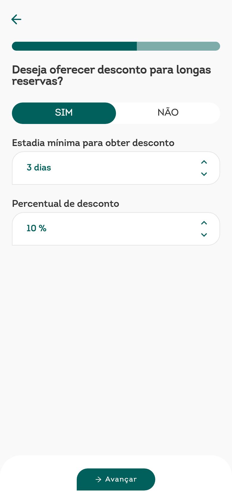

| Campo | Tipo | Observação |
|-------|------|------------|
| Oferece desconto? (`canDiscount`) | Switcher | Habilita campos abaixo |
| Estadia mínima (`minimumStay`) | Numérico (dias) | Desabilitado se `false` |
| Percentual de desconto (`percentageDiscount`) | Numérico (%) | Desabilitado se `false` |

**Status:** ✅ Completo

---

<a id="form-place-space-configs"></a>

#### Etapa 7 — Configurações do Espaço `space-configs` (70%)

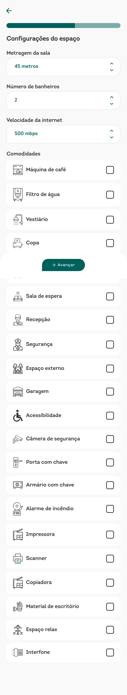

| Campo | Tipo | Observação |
|-------|------|------------|
| Metragem (`size`) | Numérico (m²) | Mínimo: 1 |
| Banheiros (`numberOfBathrooms`) | Numérico | Mínimo: 0 |
| Internet (`internetSpeed`) | Numérico (mbps) | Mínimo: 0 |
| Comodidades (`convenienceUid`) | Toggle list | Ícones por slug; múltipla seleção |

**Status:** ✅ Completo

---

<a id="form-place-rules"></a>

#### Etapa 8 — Regras e Política `rules` (80%)

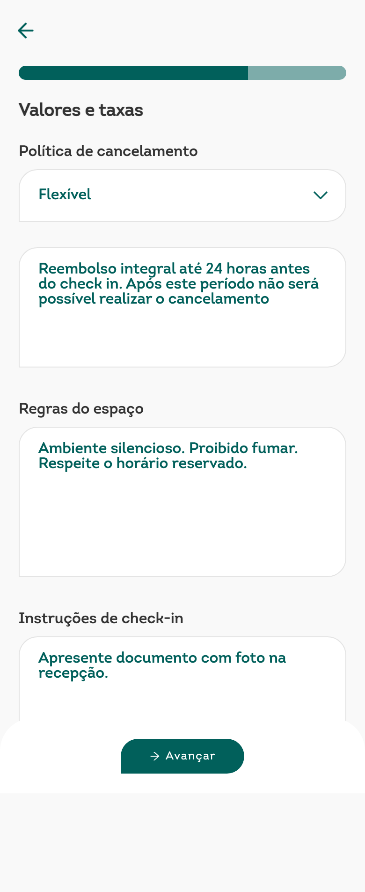

| Campo | Tipo | Observação |
|-------|------|------------|
| Política de cancelamento (`cancellationPolicyUid`) | Select | Carregado de `GET /cancellation-policy` |
| Texto da política | Textarea | Somente leitura; preenchido automaticamente |
| Regras do espaço (`rule`) | Textarea | Obrigatório |
| Instruções de check-in (`checkInInstruction`) | Textarea | Obrigatório |

**Status:** ✅ Completo

---

<a id="form-place-guests"></a>

#### Etapa 9 — Preferências de Hóspedes `guests` (85%)

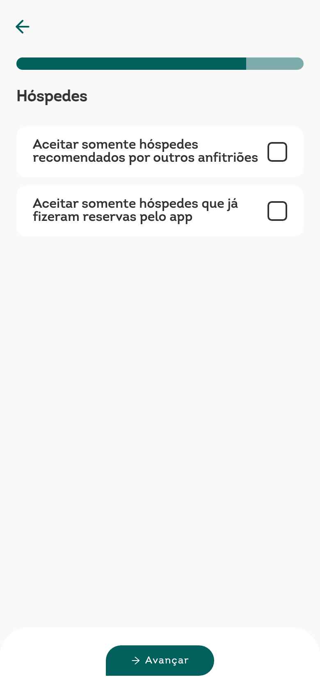

| Campo | Tipo | Observação |
|-------|------|------------|
| Preferências (`guests`) | Toggle list | `acceptOnlyRecommended`, `acceptOnlyAlreadyBooked` |

**Status:** ✅ Completo

---

<a id="form-place-images"></a>

#### Etapa 10 — Fotos do Espaço `images` (90%)

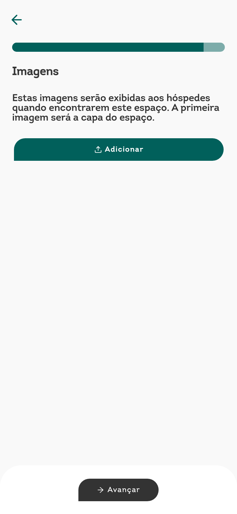

| Campo | Tipo | Observação |
|-------|------|------------|
| Imagens (`images`) | Input file | `image/*`; múltiplos; mínimo 1; upload Firebase Storage |

**Fluxo de saída**
- Confirmar → `POST /place` (criação) ou `PATCH /place/:uid` (edição) → `result`

**Status:** ⚠️ Parcial

**Observações**
- Sem validação de formato MIME ou tamanho máximo por imagem
- Sem moderação de conteúdo

---

<a id="form-place-result"></a>

#### Tela de Confirmação — `result` (100%)

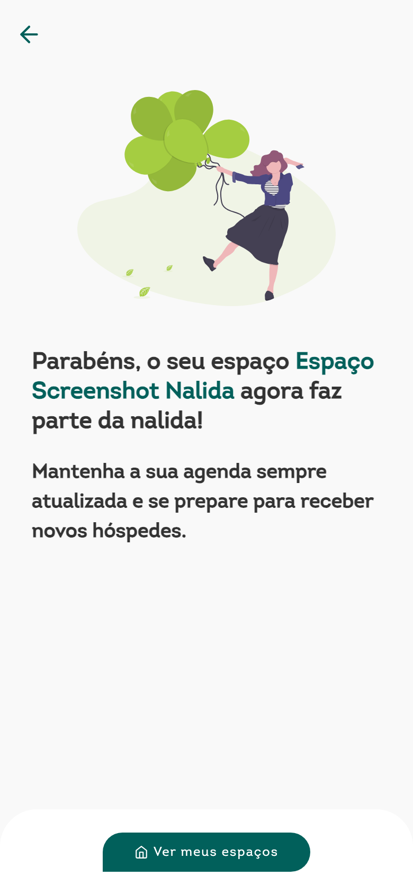

**Descrição**
Confirmação de criação ou edição bem-sucedida. Limpa o `localStorage` ao carregar.

**Status:** ✅ Completo

**Observações**
- Espaço publicado diretamente — sem etapa de revisão ou moderação

---

### Resumo de Status — Módulo 5

| Tela | Rota | Status | Lacunas |
|------|------|:------:|---------|
| Redirect lessee | `/private/lessee` | ✅ | — |
| Meus espaços | `/lessee/my-place` | ✅ | — |
| FAQ | `/lessee/faq` | ✅ | — |
| Informações gerais | `form-place/initial-info` | ✅ | — |
| Endereço | `form-place/address` | ✅ | — |
| Disponibilidade | `form-place/schedule` | ✅ | — |
| Valores diária | `form-place/values` | ✅ | Typo em `cleeaningFee` |
| Reserva por hora | `form-place/hour` | ✅ | — |
| Desconto | `form-place/discount` | ✅ | — |
| Configurações | `form-place/space-configs` | ✅ | — |
| Regras | `form-place/rules` | ✅ | — |
| Preferências | `form-place/guests` | ✅ | — |
| Fotos | `form-place/images` | ⚠️ | Sem validação MIME/tamanho; sem moderação |
| Confirmação | `form-place/result` | ✅ | Sem moderação antes de publicar |

---

---

## Módulo 6 — Gestão de Reservas pelo Proprietário

> Cobre as ferramentas de gestão do proprietário após publicar um espaço: estatísticas, agenda, aprovação/negação de reservas e avaliação de hóspedes.

**Telas cobertas:** 9

---

<a id="tela-lessee-info-place"></a>

### Tela: Estatísticas do Espaço — `/private/lessee/info-place/[uid]`

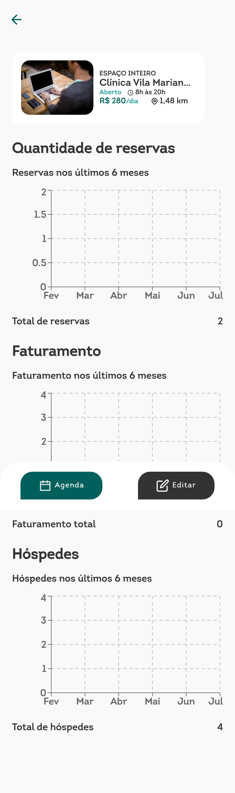

**Descrição**
Dashboard de métricas com gráficos dos últimos 6 meses.

**Funcionalidades**
- Gráfico de barras: reservas por mês
- Gráfico de linha: faturamento mensal
- Gráfico de barras: hóspedes por mês
- Chamadas paralelas a 3 endpoints de relatório

**Status:** ✅ Completo

**Observações**
- Faturamento reflete `totalPrice` do frontend — não o valor efetivamente cobrado (gateway não integrado)
- Sem taxa de ocupação, receita YTD ou ranking de horários

---

<a id="tela-lessee-schedule"></a>

### Tela: Agenda do Espaço — `/private/lessee/schedule`

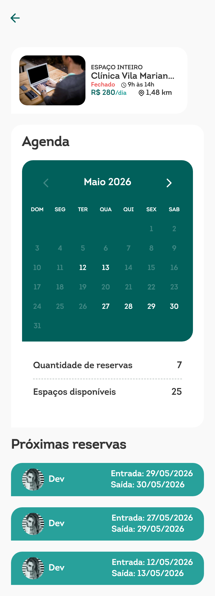

**Descrição**
Calendário de reservas com marcação de dias ocupados e estatísticas mensais.

**Funcionalidades**
- Calendário mensal com dias marcados quando há reservas ativas
- Estatísticas: total de reservas e dias disponíveis no mês
- Clicar em data → lista de hóspedes do dia

**Status:** ⚠️ Parcial

**Observações**
- Sem endpoint dedicado de agenda — depende de consulta genérica de bookings
- Agrupamento por dia feito no cliente

---

<a id="tela-lessee-status-guest"></a>

### Tela: Detalhe do Hóspede no Dia — `/private/lessee/schedule/status-guest`

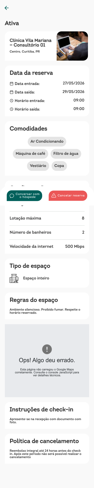

**Descrição**
Detalhes de uma reserva do ponto de vista do proprietário no dia da estadia.

**Funcionalidades**
- Dados completos: espaço, datas, horários, hóspede, mapa
- Botão "Conversar com hóspede" → `/conversations/chat/[uid]`
- Botão "Cancelar reserva"

**Status:** ⚠️ Parcial

**Observações**
- Sem campos de presença (check-in/check-out confirmados pelo proprietário)

---

<a id="tela-approve-booking"></a>

### Tela: Reservas Pendentes — `/private/lessee/approve-booking/[uid]`

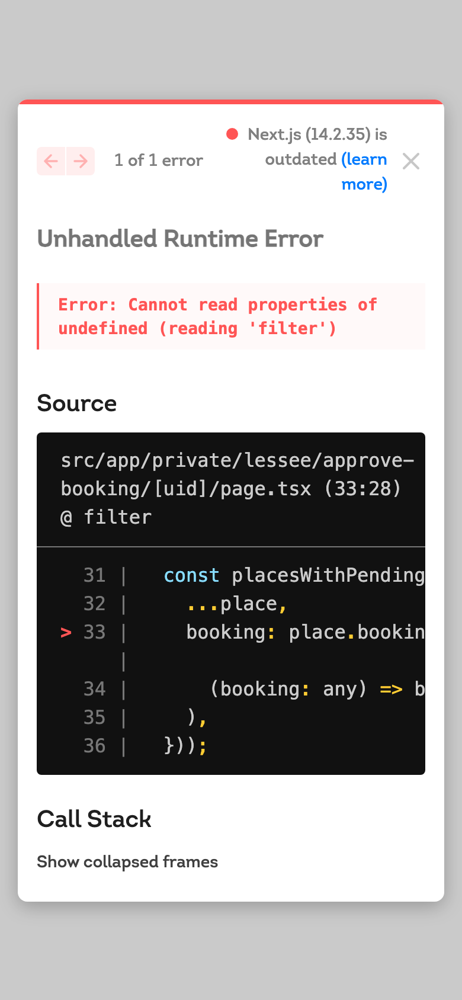

**Descrição**
Lista de reservas com status `PENDING` aguardando decisão do proprietário.

**Funcionalidades**
- Cards com dados do locatário, datas, horários e hóspedes adicionais
- Clicar → tela de decisão

**Status:** ✅ Completo

---

<a id="tela-approve-booking-detail"></a>

### Tela: Decisão sobre Reserva — `/private/lessee/approve-booking/approve/[uid]`

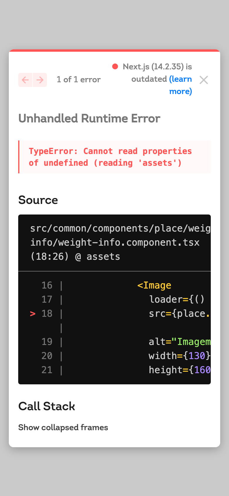

**Descrição**
Tela de confirmação ou negação de uma reserva pendente.

**Funcionalidades**
- Dados completos da reserva e do hóspede (nome, foto, avaliações)
- Botão "Confirmar" → `PATCH /booking/:uid` com `bookingStatus: CONFIRMED`
- Botão "Negar" → tela de negação

**Status:** ✅ Completo

---

<a id="tela-approve-confirmed"></a>

### Tela: Reserva Confirmada — `/private/lessee/approve-booking/approve/confirmed`

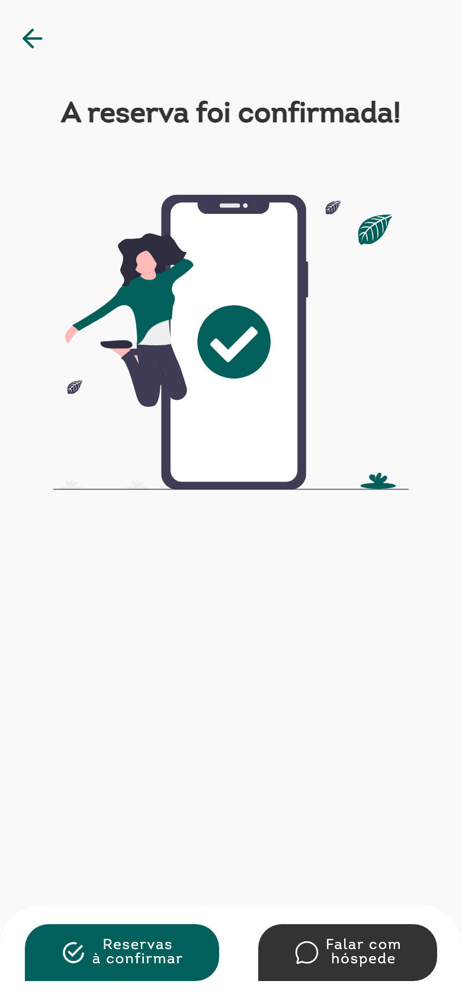

**Descrição**
Feedback visual após confirmação bem-sucedida.

**Status:** ✅ Completo

---

<a id="tela-approve-deny"></a>

### Tela: Negar Reserva — `/private/lessee/approve-booking/approve/deny`

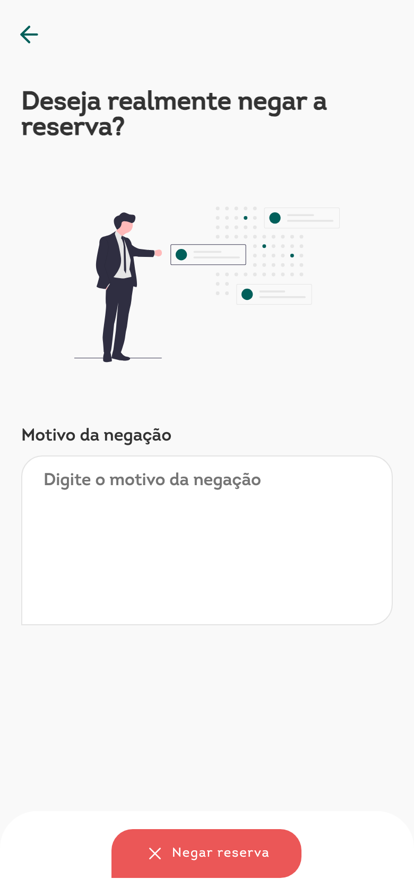

**Descrição**
Fluxo de negação com campo de motivo e confirmação.

**Funcionalidades**
- Campo de motivo (texto livre)
- Confirmação → `PATCH /booking/:uid` com `bookingStatus: REJECTED`

**Status:** ✅ Completo

**Observações**
- Motivo não persistido no backend
- Sem notificação automática ao locatário

---

<a id="tela-completed-booking"></a>

### Tela: Reservas Concluídas — `/private/lessee/completed-booking/[uid]`

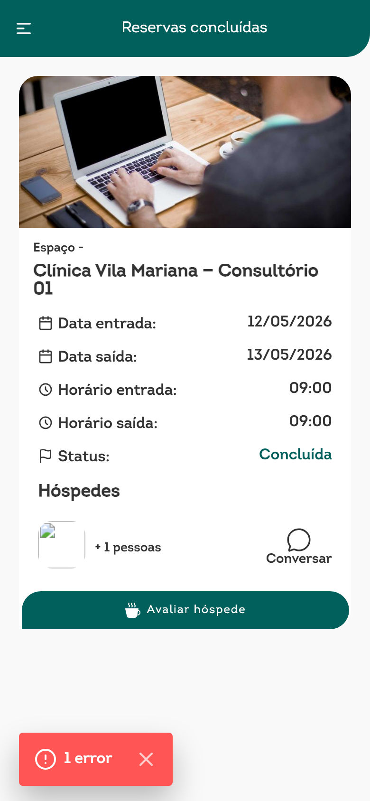

**Descrição**
Lista de reservas com status `COMPLETED` para o espaço.

**Status:** ✅ Completo

---

<a id="tela-completed-booking-approve"></a>

### Tela: Avaliar Hóspede — `/private/lessee/completed-booking/approve/[uid]`


**Descrição**
Formulário de avaliação do hóspede após conclusão da reserva.

**Funcionalidades**
- Seletor de estrelas (1–5)
- Campo de comentário
- Envio via `POST /rating` com `ratingType: guest`

**Status:** ✅ Completo

---

### Resumo de Status — Módulo 6

| Tela | Rota | Status | Lacunas |
|------|------|:------:|---------|
| Estatísticas | `info-place/[uid]` | ✅ | Faturamento não reflete pagamento real |
| Agenda | `schedule` | ⚠️ | Sem endpoint dedicado; agrupamento no cliente |
| Detalhe do hóspede | `schedule/status-guest` | ⚠️ | Sem check-in/check-out confirmados |
| Reservas pendentes | `approve-booking/[uid]` | ✅ | — |
| Decisão sobre reserva | `approve-booking/approve/[uid]` | ✅ | — |
| Reserva confirmada | `approve/confirmed` | ✅ | — |
| Negar reserva | `approve/deny` | ✅ | Motivo não persistido; sem notificação |
| Reservas concluídas | `completed-booking/[uid]` | ✅ | — |
| Avaliar hóspede | `completed-booking/approve/[uid]` | ✅ | — |

---

---

## Módulo 7 — Perfil do Usuário

> Cobre todas as telas de perfil: visualização, edição de dados pessoais, verificação de documento, métodos de pagamento, dados bancários e perfil público de hóspede.

**Telas cobertas:** 12

---

<a id="tela-profile"></a>

### Tela: Dashboard do Perfil — `/private/profile/[uid]`

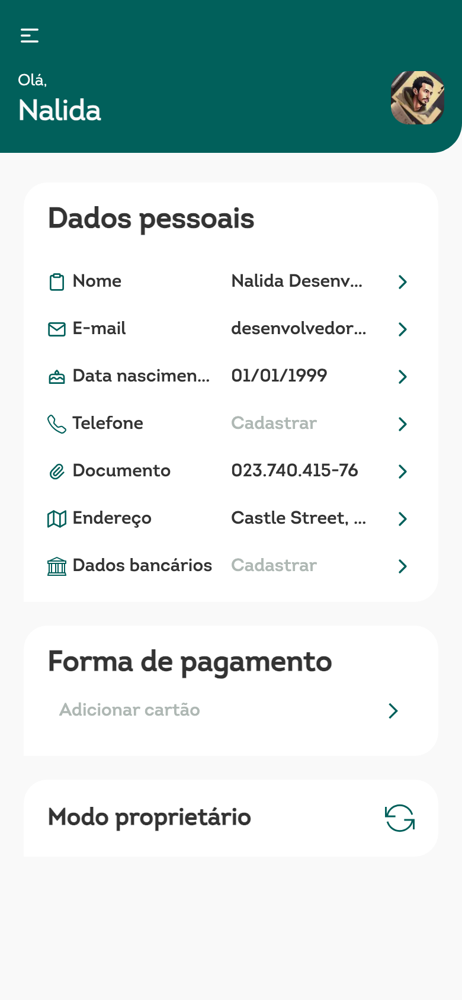

**Descrição**
Central de gerenciamento do perfil. Agrega todos os dados do usuário com links de edição.

**Funcionalidades**
- Avatar, nome e e-mail
- Dados pessoais: nome, e-mail, data de nascimento, telefone, documento, endereço
- Dados bancários para recebimento
- Métodos de pagamento (cartões)
- Toggle lessor/lessee
- Indicador de completude do perfil

**Status:** ✅ Completo

---

<a id="tela-profile-name"></a>

### Tela: Editar Nome — `/private/profile/name/[uid]`

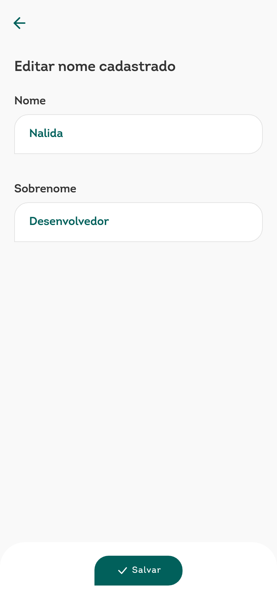

**Funcionalidades**
- Campos de nome e sobrenome (obrigatórios)
- Salvar via `PATCH /user`

**Status:** ✅ Completo

---

<a id="tela-profile-birthday"></a>

### Tela: Editar Data de Nascimento — `/private/profile/birthday/[uid]`

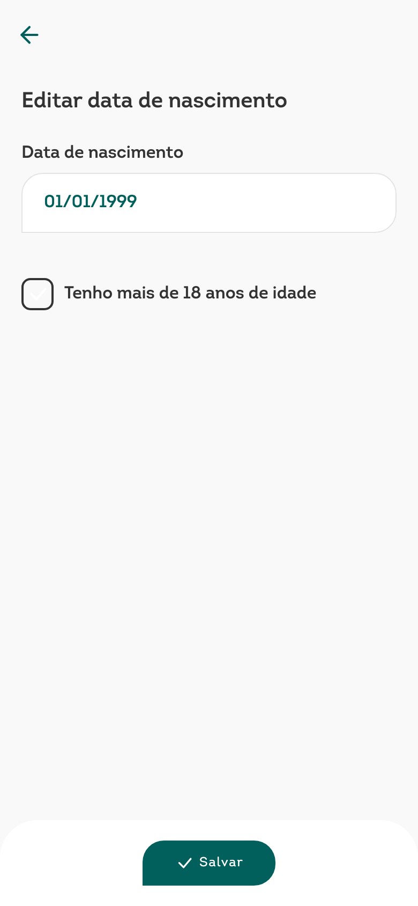

**Funcionalidades**
- Campo de data com máscara DD/MM/YYYY
- Validação de maioridade (18+) — redireciona para `/under-age` se menor

**Status:** ✅ Completo

**Observações**
- Validação apenas no frontend

---

<a id="tela-profile-address"></a>

### Tela: Editar Endereço — `/private/profile/address/[uid]`

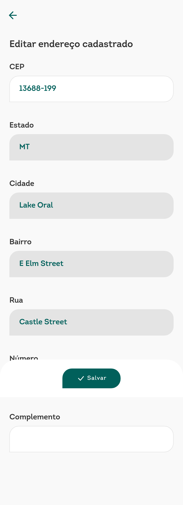

**Funcionalidades**
- CEP com consulta automática ao ViaCEP
- Estado, cidade, bairro e rua preenchidos automaticamente
- Número e complemento manuais
- Salvar via `PATCH /user`

**Status:** ✅ Completo

---

<a id="tela-profile-document"></a>

### Tela: Verificação de Documento — `/private/profile/document/[uid]`

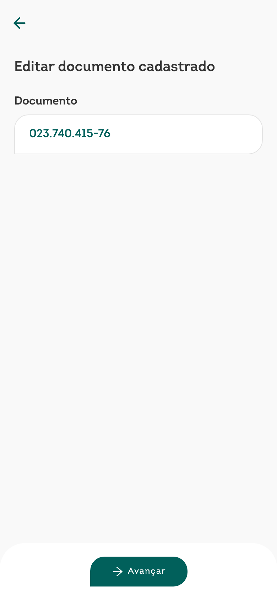

**Funcionalidades**
- Campo de CPF ou CNPJ com máscara
- Avançar para captura do documento

**Status:** ✅ Completo

---

<a id="tela-profile-document-confirm"></a>

### Tela: Instruções de Captura — `/private/profile/document/confirm`

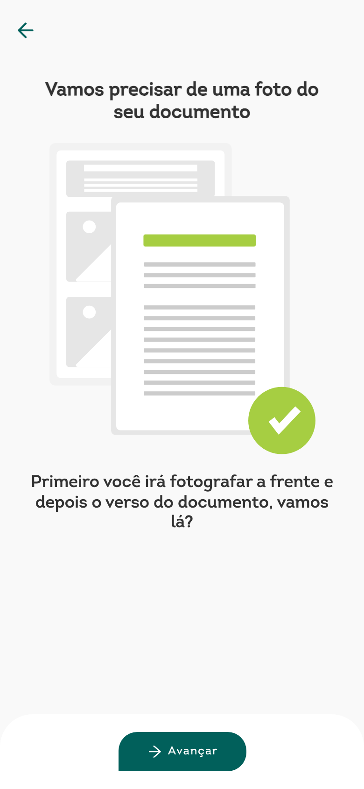

**Descrição**
Tela informativa antes da captura. Orienta o usuário sobre como fotografar o documento.

**Status:** ✅ Completo

---

<a id="tela-profile-document-picture"></a>

### Tela: Captura do Documento — `/private/profile/document/picture`

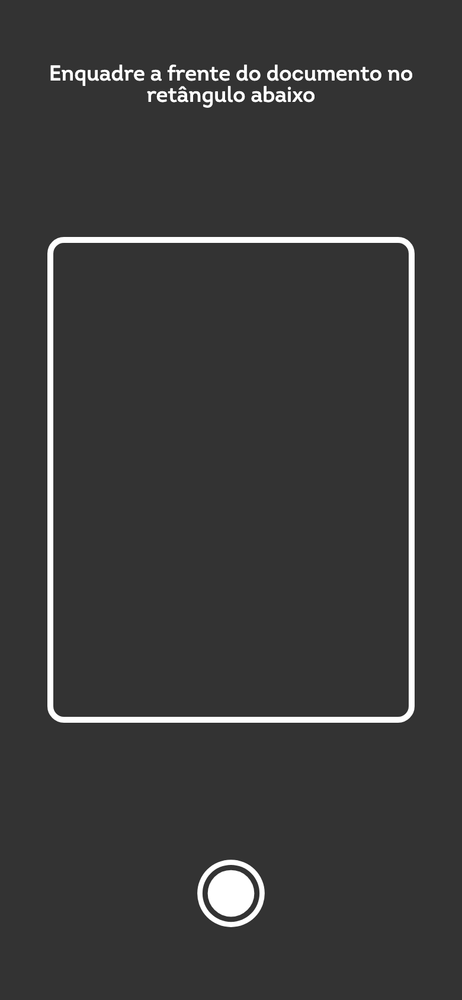

**Funcionalidades**
- Acesso à câmera do dispositivo (API nativa)
- Captura de frente e verso
- Preview com opção de repetir
- Upload para Firebase Storage → `PATCH /user`

**Status:** ✅ Completo

**Observações**
- Sem validação automática (OCR/KYC) — verificação manual
- Tela de maior complexidade do módulo

---

<a id="tela-payment-method"></a>

### Tela: Métodos de Pagamento — `/private/profile/payment-method`

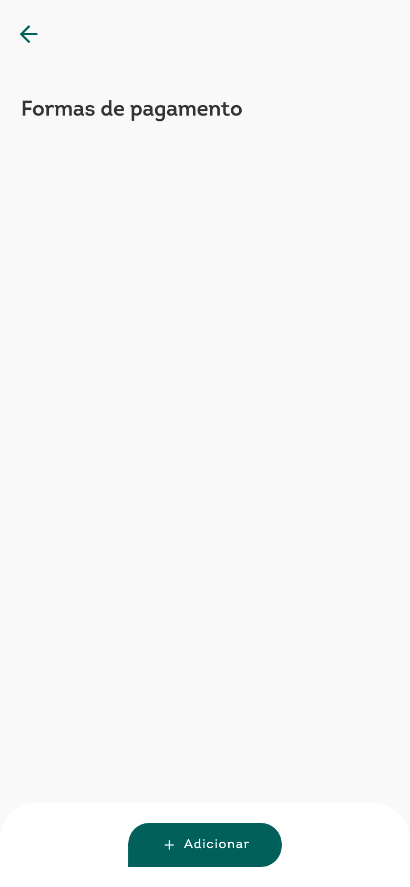

**Funcionalidades**
- Lista de cartões com bandeira, últimos 4 dígitos e nome do titular
- Badge "Padrão" no cartão principal
- Ações: editar, deletar, definir como padrão
- Botão "Adicionar cartão"

**Status:** ✅ Completo

---

<a id="tela-payment-create"></a>

### Tela: Cadastrar Cartão — `/private/profile/payment-method/create`


**Funcionalidades**
- Número do cartão com máscara e detecção de bandeira
- Nome do titular, validade (MM/AA), CVV
- Checkbox "Definir como padrão"
- Salvar via `POST /payment-method`

**Status:** ✅ Completo

**Observações**
- Dados armazenados sem tokenização via gateway — risco de segurança

---

<a id="tela-payment-edit"></a>

### Tela: Editar Cartão — `/private/profile/payment-method/edit`

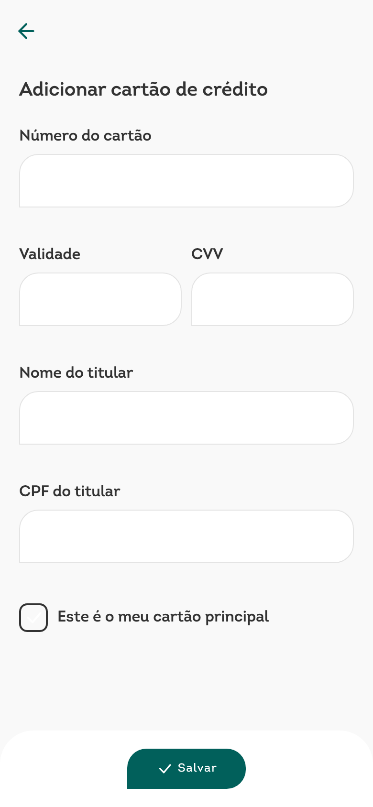

**Funcionalidades**
- Mesmos campos do cadastro, pré-preenchidos
- Salvar via `PATCH /payment-method/:uid`

**Status:** ✅ Completo

---

<a id="tela-receiver-method"></a>

### Tela: Dados Bancários — `/private/profile/receiver-method/[uid]`

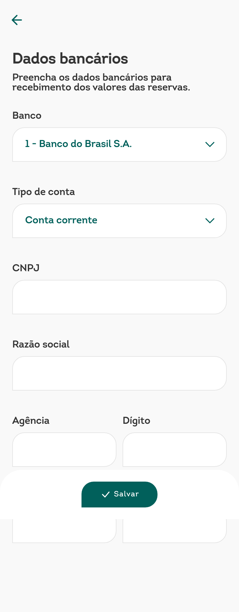

**Funcionalidades**
- Seleção de banco (lista completa de bancos brasileiros)
- Tipo de conta: corrente, poupança ou pagamento
- CPF/CNPJ, razão social, agência e conta com dígitos
- Salvar via `PATCH /user`

**Status:** ✅ Completo

**Observações**
- Sem integração com gateway de pagamento
- Sem validação de conta bancária real (Pix / Open Finance)

---

<a id="tela-guest-profile"></a>

### Tela: Perfil Público do Hóspede — `/private/profile/guest-profile/[uid]`

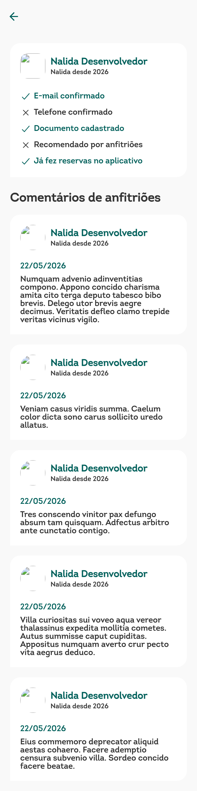

**Descrição**
Perfil público acessível por proprietários durante o processo de aprovação de reserva.

**Funcionalidades**
- Avatar, nome, bio e data de entrada na plataforma
- Avaliações recebidas de anfitriões anteriores (estrelas + comentário)
- Média geral de avaliações

**Status:** ✅ Completo

---

### Resumo de Status — Módulo 7

| Tela | Rota | Status | Lacunas |
|------|------|:------:|---------|
| Dashboard do perfil | `profile/[uid]` | ✅ | — |
| Editar nome | `profile/name/[uid]` | ✅ | — |
| Editar data de nascimento | `profile/birthday/[uid]` | ✅ | Validação só no frontend |
| Editar endereço | `profile/address/[uid]` | ✅ | — |
| Verificação de documento | `profile/document/[uid]` | ✅ | — |
| Instruções de captura | `profile/document/confirm` | ✅ | — |
| Captura do documento | `profile/document/picture` | ✅ | Sem KYC/OCR |
| Métodos de pagamento | `profile/payment-method` | ✅ | — |
| Cadastrar cartão | `payment-method/create` | ✅ | Sem tokenização via gateway |
| Editar cartão | `payment-method/edit` | ✅ | — |
| Dados bancários | `profile/receiver-method/[uid]` | ✅ | Sem validação de conta real |
| Perfil público do hóspede | `profile/guest-profile/[uid]` | ✅ | — |

---

---

## Consolidado Geral

### Cobertura por Módulo

| Módulo | Telas | ✅ Completo | ⚠️ Parcial | ❌ Ausente |
|--------|:-----:|:-----------:|:----------:|:---------:|
| 1 — Autenticação e Acesso | 9 | 2 | 6 | 1 |
| 2 — Descoberta de Espaços | 3 | 2 | 1 | 0 |
| 3 — Fluxo de Reserva | 7 | 3 | 3 | 0 |
| 4 — Mensagens e Conversas | 2 | 0 | 2 | 0 |
| 5 — Painel do Proprietário | 15 | 13 | 1 | 0 |
| 6 — Gestão de Reservas | 9 | 7 | 2 | 0 |
| 7 — Perfil do Usuário | 12 | 12 | 0 | 0 |
| **Total** | **57** | **39** | **15** | **1** |

---

### Principais Lacunas por Prioridade

#### Críticas (impacto direto na operação)

| Lacuna | Módulo | Rota |
|--------|--------|------|
| Gateway de pagamento não integrado | 3 | `booking/confirm` |
| Dados de cartão sem tokenização | 7 | `payment-method/create` |
| Renovação automática de token (refresh) | 1 | Transversal |

#### Importantes (funcionalidade incompleta)

| Lacuna | Módulo | Rota |
|--------|--------|------|
| Nome e data de nascimento não persistidos no cadastro | 1 | `register/step-two` |
| Política de cancelamento apenas visual | 3 | `status-book/cancel` |
| Bug: botão cancelar aparece no status errado | 3 | `status-book/[uid]` |
| Notificações push (FCM) sem integração | 1 | `/notifications` |
| Aceite de termos não auditável | 1 | `/privacy` |
| Histórico de chat sem backup no MongoDB | 4 | `conversations/chat` |

#### Melhorias (qualidade e completude)

| Lacuna | Módulo | Rota |
|--------|--------|------|
| Filtros de preço/distância processados no cliente | 2 | `/private/more` |
| Busca por texto sem full-text search | 2 | `/private/more` |
| Validação de MIME/tamanho nas fotos do espaço | 5 | `form-place/images` |
| Sem moderação de conteúdo antes de publicar | 5 | `form-place/result` |
| Agenda sem endpoint dedicado no backend | 6 | `lessee/schedule` |
| Verificação de identidade sem KYC/OCR | 7 | `document/picture` |
| Dados bancários sem validação real | 7 | `receiver-method` |

---

### Funcionalidades Transversais

| Funcionalidade | Módulos | Status |
|----------------|---------|:------:|
| Firebase Auth (Google OAuth) | 1 | ✅ |
| Firebase Auth (e-mail/senha) | 1 | ⚠️ |
| Geolocalização do navegador | 1, 2 | ⚠️ |
| Google Maps (mapa interativo) | 2, 3, 6 | ✅ |
| Google Maps Geocoding (CEP → lat/lng) | 5, 7 | ✅ |
| ViaCEP (preenchimento automático) | 5, 7 | ✅ |
| Firebase Storage (upload de imagens) | 5, 7 | ✅ |
| Firebase Realtime Database (chat) | 4 | ⚠️ |
| Formulários multi-step com progresso | 1, 3, 5 | ✅ |
| Persistência em `localStorage` | 3, 5 | ✅ |
| Cálculo dinâmico de preços | 3 | ✅ |
| Avaliações com estrelas | 3, 6 | ✅ |
| Gráficos de estatísticas (recharts) | 6 | ✅ |
| Câmera do dispositivo | 7 | ✅ |
| Gateway de pagamento | 3, 7 | ❌ |
| Push notifications (FCM) | 1 | ❌ |
| KYC / verificação de identidade | 7 | ❌ |

---

*Relatório gerado em 22 de maio de 2026 · TrinityWeb*
